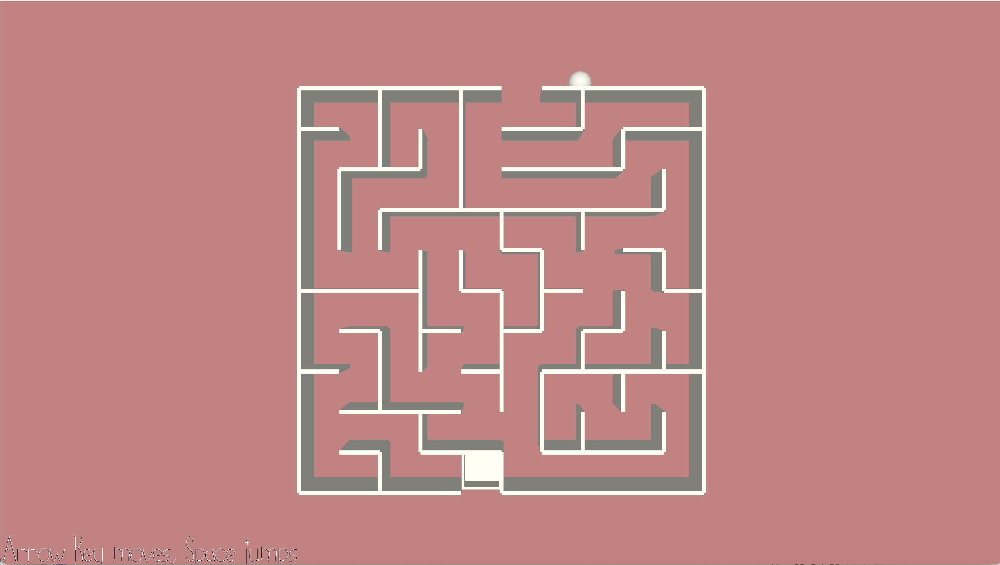

# (3D Maze)

Author: Zixin Qiu

Design: This is a 3D maze game. You can control the ball in x and y directions and the ball is subject to gravity.

Screen Shot:

How To Play:

Move the ball with arrow keys left and right. Press Space to Jump. You win if you reach to the door at the bottom.

This game was built with [NEST](NEST.md).
